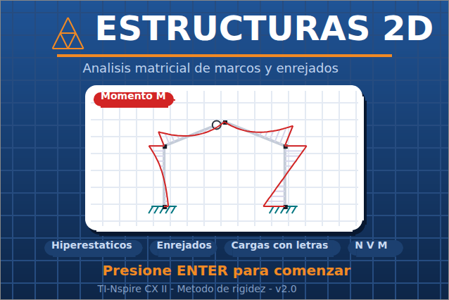
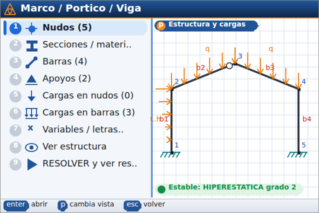
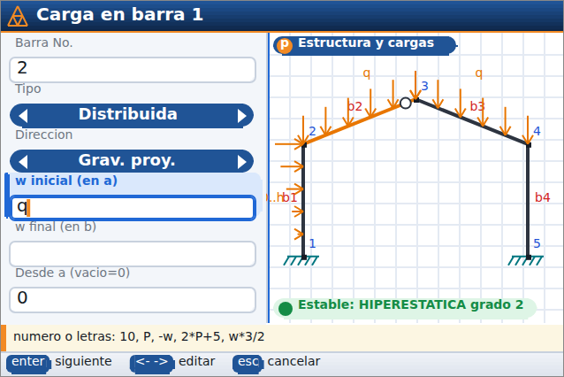
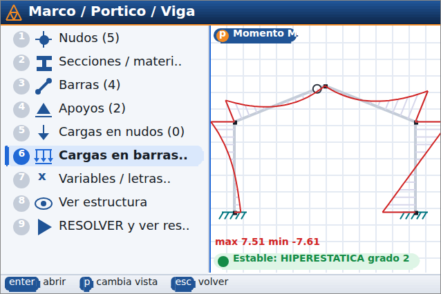

# Estructuras 2D para TI-Nspire CX II / CX II CAS

Programa en Lua para analizar **marcos (pórticos, vigas continuas) hiperestáticos** y
**enrejados (armaduras)** por el método de rigidez, con un menú interactivo al
estilo DOVAS. Entrega reacciones, desplazamientos, esfuerzos en los extremos,
tablas por barra y **diagramas de momento, corte, axial y deformada**.

Las cargas pueden ser **números o letras** (`10`, `P`, `-w`, `2*P+5`, `w*3/2`...).
El resultado sale en forma literal, por ejemplo `M = 12.5 + 3.2P - 0.5w`, porque el
programa resuelve un caso por cada letra y combina los resultados por superposición.

## Capturas

| Portada | Pantalla dividida |
|---|---|
|  |  |
| **Formulario con vista en vivo** | **Vista de momento en vivo** |
|  |  |

Al abrir el programa aparece una portada animada: el pórtico de ejemplo se resuelve de
verdad y su diagrama de momentos crece en pantalla. Cualquier tecla lleva al menú
principal; la opción *Acerca de / portada* la muestra otra vez.

## Archivos

| Archivo | Uso |
|---|---|
| `Estructuras2D.tns` | Documento listo para copiar a la calculadora (generado con Luna). |
| `estructuras.lua` | Código fuente (pegar en el *Script Editor* del software TI-Nspire). |
| `tests/test.lua` | Pruebas de escritorio: `lua5.1 tests/test.lua` |

## Instalación

**Opción A:** copie `Estructuras2D.tns` a la calculadora con TI-Nspire Computer Link o con
el software TI-Nspire (arrastrar y soltar).

**Opción B:** en el software TI-Nspire (Student o Teacher) abra un documento nuevo, vaya a
*Insertar → Editor de scripts → Insertar script*, pegue el contenido de `estructuras.lua`,
elija *Establecer script* (Ctrl+S) y guarde el documento `.tns`.

El modelo se guarda dentro del documento: al guardar el `.tns` en la calculadora, sus
datos quedan guardados para la próxima vez que lo abra.

## Pantalla dividida (vista en vivo)

Al editar el modelo, la pantalla se divide en dos: a la izquierda se ingresan los datos
(menú, listas y formularios) y a la derecha se ve la estructura, que se actualiza sola,
incluso mientras escribe, antes de aceptar. Ahí se ve lo siguiente:

* El nudo, la barra, el apoyo o la carga seleccionados, resaltados en naranja.
* Las cargas dibujadas con su valor o su letra.
* El estado: **ISOSTÁTICA**, **HIPERESTÁTICA grado n** o el motivo por el que
  no se puede resolver (inestable, falta un apoyo, etc.).
* Con la tecla `p` (en menús y listas) se cambia la vista entre *Estructura*, *Momento M*,
  *Corte V*, *Axial N* y *Deformada*. Los diagramas se recalculan con cada cambio.

## Uso rápido

1. **Nuevo marco** o **Nuevo enrejado** (o cargue un **Ejemplo**).
2. **Nudos**: coordenadas X, Y (acepta expresiones: `4*sqrt(2)`, `a/2`).
3. **Secciones**: E, A, I (α y h solo si usa temperatura). Con E=1 e I=1 los
   desplazamientos quedan multiplicados por EI. Si usa A=1e5 (valor por defecto en
   marcos), las barras son prácticamente rígidas axialmente.
4. **Barras**: nudo i → nudo j, sección y rótulas (articulación interna) en i y/o j.
5. **Apoyos**: empotrado, articulado, rodillos, guías, personalizado; ángulo (apoyo
   inclinado), resortes y asentamientos (también pueden llevar letras).
6. **Cargas en nudos**: Fx, Fy, M.
7. **Cargas en barras**:
   * Puntual (P en la posición `a`), momento concentrado.
   * Distribuida lineal de `w1` en `a` a `w2` en `b`, que cubre la uniforme, la triangular, la trapezoidal
     y las cargas parciales. Las posiciones pueden usar `L` (ej. `L/3`).
   * Direcciones: perpendicular local, axial local, global X/Y, gravedad (-Y), y
     proyectadas (carga por metro de proyección horizontal o vertical).
   * Temperatura (ΔT uniforme y gradiente T_inf − T_sup) y error de fabricación (ΔL).
8. **Variables**: asigne un valor a una letra. Si *Letra en resultados = Sí*, la letra
   sigue apareciendo en los resultados y su valor solo se usa para los gráficos (una
   letra sin valor vale 1 en los gráficos). Si es *No*, se reemplaza por el número.
9. **RESOLVER**: diagramas, reacciones, desplazamientos, esfuerzos, tabla por barra
   (valores literales y numéricos, máximos y mínimos, flecha máxima) y verificación del
   equilibrio global.

### Teclas

* Menús: flechas + `enter`, o el número de la opción; `esc` vuelve.
* Listas: `+` agrega, `enter` edita, `del` borra, `p` cambia la vista de la derecha.
* Formularios: al teclear se reemplaza el valor del campo; con ← → se mueve el cursor
  para editarlo. En opciones, ← → cambia la opción. Guarde con **[ACEPTAR]**.
* Diagramas: ← → cambia de barra, `m` `v` `n` `d` cambia el diagrama, ↑ ↓ cambia la
  escala, `tab` muestra u oculta los valores, `enter` abre la tabla de la barra. En
  enrejados, `o` alterna entre barras coloreadas y el diagrama tradicional.
* Tecla `menu`: accesos rápidos a todas las pantallas.

## Convenciones

* Global: X a la derecha, Y hacia arriba, giros y momentos antihorarios positivos.
* Local: x va del nudo i al j; y local queda a 90° en sentido antihorario.
* N (+) es tracción. M (+) tracciona la fibra inferior (lado −y local); el diagrama
  de M se dibuja del lado traccionado.
* Para una carga de gravedad use la dirección *Gravedad (−Y)* con un valor positivo.

## Verificación

`tests/test.lua` compara el motor con soluciones clásicas: viga biempotrada con carga
uniforme, viga continua (−wL²/8), empotrada-apoyada (−3PL/16), rótulas, asentamientos
(6EIΔ/L²), temperatura, carga triangular, apoyo inclinado, resortes, armadura Pratt,
enrejado hiperestático, detección de mecanismos y equilibrio de todos los ejemplos.
También recorre la interfaz con una simulación de la API de la TI-Nspire.
